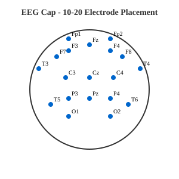
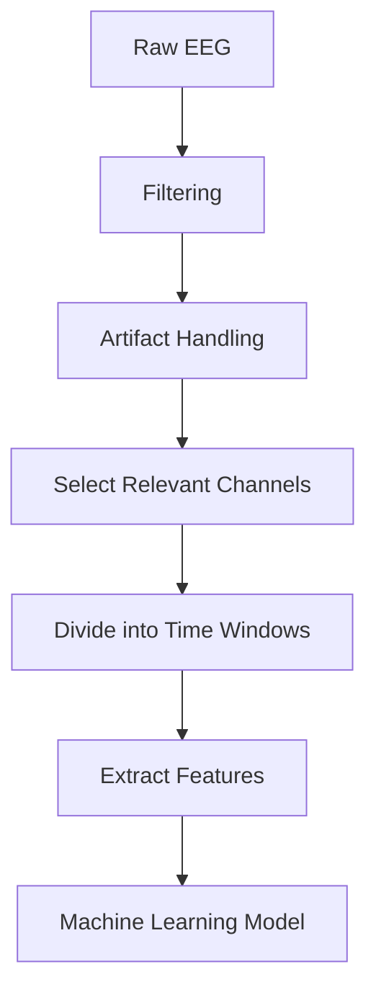

# What Does an EEG Recording Actually Look Like to a Computer?

When I first heard people talk about EEG, I imagined the familiar image: several wavy lines moving across a screen.

Something that looked obviously like “brain activity.”

Then I started looking at actual EEG data.

The computer does not see a brain.

It sees numbers.

A lot of them.

That simple realization helped me understand EEG much better.

This article is my attempt to explain what those numbers represent, how they become something we can analyze, and why so many important decisions happen before a machine-learning model ever sees the data.



*Figure 1: Standard EEG electrode placement according to the international 10-20 system*

---

## First: what is EEG measuring?

EEG stands for **electroencephalography**.

Electrodes are placed on the scalp and measure tiny voltage differences related to electrical activity produced by populations of neurons.

That wording matters.

EEG is not a camera pointed at the brain.

An electrode does not tell us:

> “This person is thinking about food.”

or:

> “This neuron just fired.”

What we receive is a changing electrical signal measured over time.

That signal is affected by the brain, but also by many other things.

Which is where the engineering problem starts.

---

## From a person to a matrix of numbers

Imagine someone wearing an EEG cap with several electrodes.

Each electrode gives us a signal.

One electrode might be called:

`F3`

Another:

`Cz`

Another:

`O1`

These names refer to locations on the scalp.

For each location, the system repeatedly records a voltage value.

So instead of seeing a “brain,” a computer might receive something conceptually like this:

| Time | F3 | F4 | Cz | O1 |
|---|---:|---:|---:|---:|
| 0.000 s | 8.2 | 4.1 | -2.0 | 6.4 |
| 0.004 s | 8.6 | 4.0 | -1.7 | 6.8 |
| 0.008 s | 7.9 | 4.5 | -1.3 | 7.0 |
| 0.012 s | 7.1 | 5.0 | -0.8 | 6.7 |

Suddenly EEG looked much less mysterious to me.

From a software perspective, it is a **multichannel time series**.

You have:

**channels**

values from different electrode locations

**time**

when each measurement happened

**samples**

the individual recorded values

And sometimes:

**events**

information about what was happening during the recording.

That last part becomes very important.

---

## Sampling: how often are we measuring?

A signal changes continuously.

A computer cannot store an infinite number of measurements, so the EEG system samples the signal at regular intervals.

For example, suppose the sampling rate is:

**250 Hz**

That means the system records approximately 250 samples every second for each channel.

With 64 channels:

`250 samples × 64 channels`

every second.

Record for several minutes, and the dataset grows quickly.

This was another useful connection for me.

EEG may come from neuroscience, but once it reaches software, many familiar engineering questions appear.

How much data are we collecting?

How is it stored?

How do we process it efficiently?

Which parts matter?

Which parts are noise?

---

## And there is a lot of noise

This was probably one of the biggest things I misunderstood at first.

I imagined EEG signals as clean brain waves.

They are not.

A recording can contain activity caused by:

- blinking
- eye movements
- jaw movement
- facial muscles
- head movement
- poor electrode contact
- electrical interference
- other recording artifacts

If someone blinks, that can create a strong pattern in the signal.

The computer does not automatically know:

> “Ignore this. Nada just blinked.”

It only sees the values change.

That means preprocessing is not just a boring step before the “real AI.”

It is part of the problem.

---

## Raw data is not ready for machine learning

My first instinct as a software student would have been:

> We have data. Let's train a model.

EEG makes that instinct dangerous.

Before training anything, researchers may need to make decisions about filtering, bad channels, artifacts, referencing, segmentation and many other details.

A simplified pipeline could look like this:

**raw EEG**

↓

**filtering**

↓

**artifact handling**

↓

**select relevant channels**

↓

**divide the recording into useful time windows**

↓

**extract features or prepare the signal**

↓

**machine-learning model**

The model is almost at the end.

A lot has already happened before it gets there.

---

## What is filtering doing?

EEG contains activity at different frequencies.

Some changes happen slowly. Others happen faster.

Researchers often use filters to focus on particular frequency ranges or remove unwanted parts of the signal.

This is where terms such as these start appearing:

**delta**

**theta**

**alpha**

**beta**

**gamma**

These frequency bands are often discussed in relation to different brain states and processes.

But I am being careful with them.

It is very easy to find simplified claims online such as:

> “Alpha means relaxation.”

or:

> “Beta means concentration.”

The real interpretation is more complicated.

Frequency activity depends on brain region, task, experimental design and many other factors.

So I am trying to learn the signal first before attaching psychological meaning to every wave I see.

---

## Events give the signal context

Imagine an experiment where a participant sees an image every few seconds.

The EEG recording alone is a continuous stream of values.

But the researcher may also store event markers:

```text
10.0 s → image appeared

12.0 s → participant responded

15.0 s → next image appeared
```

Now we can connect parts of the EEG recording to something that happened.

This allows researchers to cut the continuous signal into smaller pieces around those events.

These pieces are often called **epochs**.

For example:

```text
-0.5 seconds → before stimulus

0 seconds → stimulus appears

+1.0 second → after stimulus
```

Now instead of asking:

> What happened during this entire 20-minute recording?

we can ask:

> What happened in the brain signal around this specific event?

That feels much closer to an experiment.

---

## Channels also have spatial meaning

One thing I had not understood before reading about EEG was that channel location matters.

Electrodes are positioned across different parts of the scalp.

So an EEG dataset is not simply:

**signal over time**

It is closer to:

**signal × time × location**

That makes the data more interesting, but also harder.

A model could potentially learn patterns involving:

- when something happened
- how strong the signal was
- its frequency
- where on the scalp it appeared

The number of possible patterns grows quickly.

---

## Where machine learning enters

Once the signal has been prepared, machine learning can be used for many different tasks.

For example:

**classification**

Was the participant performing task A or task B?

**detection**

Does this section contain a pattern associated with drowsiness?

**regression**

Can we estimate a continuous variable from the signal?

**prediction**

Can earlier signal patterns tell us something about what happens next?

This is where my original truck-driver question comes back.

If researchers want to detect driver fatigue from EEG, the model needs examples of EEG recorded under different levels of alertness.

The computer then tries to learn which patterns separate those states.

But there is another question that now interests me even more:

> How do we know the model learned something real?

---

## A model can cheat without us noticing

Suppose we record EEG from several people.

Then we divide tiny pieces of those recordings randomly between training and testing data.

The model might perform extremely well.

Great.

Except there is a problem.

Pieces from the same person may appear in both sets.

EEG can contain characteristics that are specific to an individual.

Instead of learning:

> “This is what fatigue looks like.”

the model might partly learn:

> “This looks like participant 7.”

That means a very high accuracy score may not tell us what we think it tells us.

This is one of the ideas I want to explore experimentally later.

The way we split the dataset may be just as important as the model we choose.

---

## EEG made me see machine learning differently

In many beginner ML exercises, the dataset feels finished.

You download a CSV.

You choose some columns.

You train a model.

You measure accuracy.

Biomedical signals make that picture fall apart.

The dataset itself is the result of many decisions.

How was the experiment designed?

Where were the electrodes?

What was the sampling rate?

What was filtered?

Which channels were removed?

How were artifacts handled?

How were examples created?

How was the train/test split performed?

Those decisions can change the result before we even start comparing algorithms.

For me, that is one of the most interesting parts.

The difficult question may not be:

> Which model gives the highest accuracy?

It may be:

> What exactly are we asking the model to learn?

---

## What I understand now

When I look at an EEG recording now, I no longer imagine mysterious waves that somehow reveal thoughts.

I see a measurement system.

A person produces physiological activity.

Electrodes measure voltage differences.

The recording system samples them.

Software stores them as multichannel time-series data.

Researchers clean and organize that data.

Then algorithms look for patterns.

And every arrow in that pipeline contains assumptions.

```text
person
   ↓
electrodes
   ↓
electrical measurements
   ↓
samples and channels
   ↓
preprocessing
   ↓
epochs / features
   ↓
model
   ↓
prediction
   ↓
interpretation
```

The last arrow may be the most dangerous one.

A prediction is not automatically an explanation of the brain.

---

## What I still don't understand

A lot.

And I want to keep this list visible instead of hiding it behind polished explanations.

I still want to understand:

- how EEG referencing really affects the signal
- what different filters do mathematically
- how artifacts are detected and removed
- what frequency bands actually tell us
- how CSP works for motor imagery
- how researchers choose useful EEG features
- when deep learning is better than classical methods
- how much EEG varies between people
- why models often struggle on completely unseen subjects
- what makes an EEG experiment scientifically convincing

These are no longer random vocabulary words to me.

They are questions I can investigate one at a time.

---

## The next thing I want to test

Reading about EEG is useful.

Opening a real EEG dataset should be better.

For the next step, I want to take a public motor-imagery dataset and inspect it with Python.

Not train a huge neural network.

Not chase a high accuracy score.

First I want to understand the data.

How many subjects are there?

How many channels?

What does one recording look like?

What happens when I plot it?

Where are the events?

What does filtering change?

What happens when someone blinks?

And only then:

Can I build a simple classifier?

The helmet that started these questions turned brain activity into data.

Now I want to see exactly what that data looks like before asking AI to do anything with it.

---

## Visualizing the Pipeline

To better understand how EEG data flows from raw signals to insights, let's look at the preprocessing pipeline:



*Figure 2: Typical EEG preprocessing pipeline showing the journey from raw data to model input*